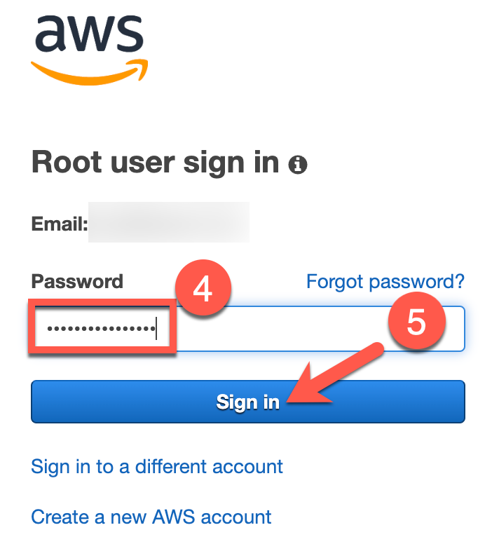
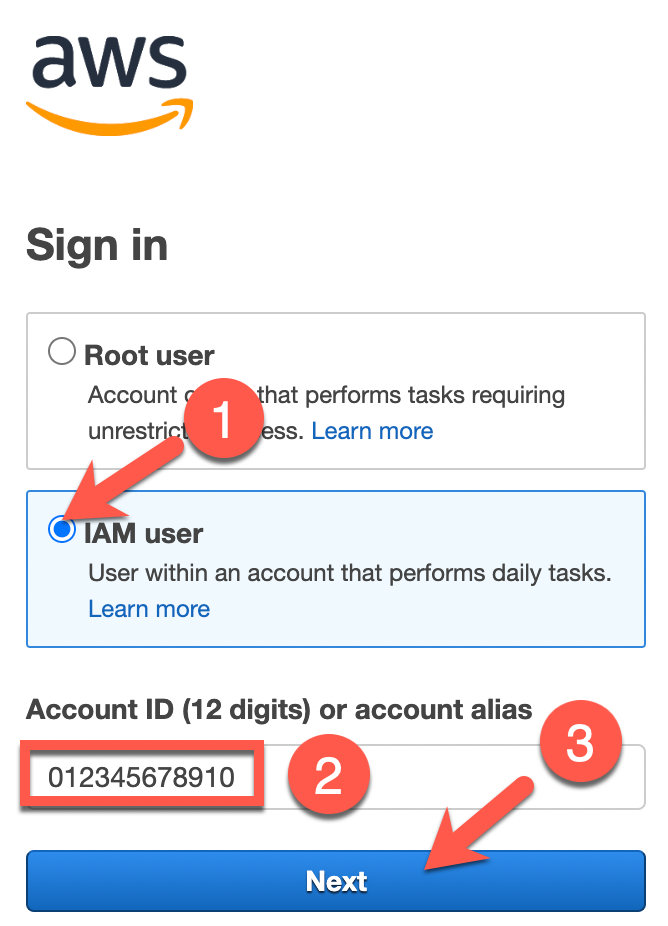
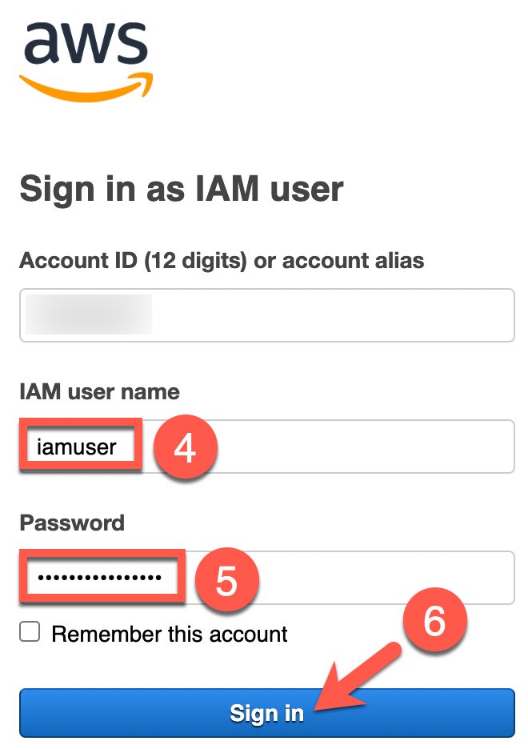

# Exercise 1: Deploying the Workshop Resources

**Estimated time to complete:** 15 minutes

## Objectives

* Log into AWS account and launch **CloudShell** session in the N. Virginia (**us-east-1**) region.
* Download source code using `git` from developer's [GitHub repository](https://github.com/bluemountaincyber/evidence-app).
* Deploy workshop resources using AWS CloudFormation.

## Challenges

### Challenge 1: Launch AWS CloudShell

The exercises performed in this workshop are designed to simply use your web browser - no additional tools (e.g., virtual machines, SSH clients) required! Many cloud vendors allow customers to generate a shell session in a vendor-managed container/VM to perform basic tasks. We will use this to our advantage to deploy, test, and analyze an application called **evidence-app**.

Begin by logging into your AWS account and launch a **CloudShell** session  in the **N. Virginia (us-east-1)** region.

??? cmd "Solution"

    1. Navigate to [https://console.aws.amazon.com](https://console.aws.amazon.com) and sign in with either your root user account or an IAM user with **AdministratorAccess** permissions.

        !!! note "Root User"

            Select the **Root user** radio button (1), enter your email address used to sign up for AWS in the **Root user email address** text field (2), and click the **Next** button (3). On the next page, enter your password in the **Password** text field (4) and click the **Sign in** button (5).

            {: class="w300" }
            {: class="w300" }

        !!! note "IAM User"

            Select the **IAM user** radio button (1), enter your AWS account number of alias in the **Account ID (12 digits) or account alias** text field (2), and click the **Next** button (3). On the next page, enter your IAM username in the **IAM user name** text field (4), enter your IAM user's password in the **Password** text field (5), and click on the **Sign in** button (6).

            {: class="w300" }
            {: class="w300" }

    2. When you arrive at the **AWS Management Console**, ensure that you are currently interacting with the **N. Virginia (us-east-1)** region by taking a look at the top-right of the page. You should see **N. Virginia**. If you see a different region, click the down arrow next to the region's name (1) and select **East US (N. Virginia** (2).

        {: class="w400" }

    3. Now that you are interacting with the **N. Virginia (us-east-1)** region, click on the icon near the top-right that looks like a command prompt to start a **CloudShell** session.

        {: class="w500" }

    4. On the next page, you will see a banner that states *Waiting for environment to run...*. Wait a minute or two until you see a command prompt that looks similar to `[cloudshell-user@ip-10-1-82-127 ~]$` (your hostname will vary).

        {: class="w500" }

    !!! note

        Your **CloudShell** session will expire after roughly 20 minutes of inactivity. If this happens, simply attempt to type and the session should resume. If this does not work, refresh the page.

### Challenge 2: Download Workshop Code

In order to rapidly set up some realistic targets in your environment that you will attack, as well as setup some of the more time-consuming resources to assist in the automated detection, there is some Infrastructure as Code (IaC) provided in [this GitHub repository](https://github.com/bluemountaincyber/building-detections-aws).

Now that you are in a **CloudShell** session, you will need to download this code in order to deploy these resources via AWS CloudFormation. But how to pull the code down to the session? That's easy! AWS provides `git` in their **CloudShell** environment!

??? cmd "Solution"

    1. Ensure that you are in your **CloudShell** session's home directory by running the following commands:

        ```bash
        cd /home/cloudshell-user
        pwd
        ```

        !!! summary "Expected Result"

            ```bash
            /home/cloudshell-user
            ```

    2. Use `git` to clone the **evidence-app** source code.

        ```bash
        git clone https://github.com/bluemountaincyber/building-detections-aws
        ```

        !!! summary "Expected result"

            ```bash
            
            ```

    3. Ensure that the code downloaded by running the following command:

        ```bash
        ls -la /home/cloudshell-user/building-detections-aws/
        ```

        !!! summary "Expected Result"

            ```bash
            
            ```

### Challenge 3: Deploy Workshop IaC Resources

Finally, you have all of the components needed to deploy the application in your AWS account.

Use `deploy.sh` to deploy the IaC (which can be found in the `scripts` directory of the repo you just downloaded). Ensure that all worked properly by searching for the following AWS resources:

    - [ ] IAM user named `HoneyToken`
    - [ ] Lambda function named `HoneyTokenDetection`
    - [ ] CloudTrail trail named `security`
    - [ ] S3 bucket beginning with the name `cloudlogs-`
    - [ ] Security Hub is successfully deployed

    !!! warning

        If you already have Security Hub setup in your AWS account within the N. Virginia region (us-east-1), your deployment will fail. The failure will look like this:

        !!! summary "Failed deployment"

            ```bash
            
            ```
        
        If that happens, you can run the following commands after this failure and try again:

        ```bash

        ```

??? cmd "Solution"

    1. Before you can deploy resources using the `cloudformation-deploy.sh` script, you must be in the current directory where those files reside. Navigate to `/home/cloudshell-user/evidence-app`.

        ```bash
        cd /home/cloudshell-user/evidence-app
        pwd
        ```

        !!! summary "Expected Result"

            ```bash
            /home/cloudshell-user/evidence-app
            ```

    2. Run the `cloudformation-deploy.sh` script and, after roughly 5 minutes, you should see a URL for your evidence app.

        ```bash
        ./cloudformation-deploy.sh
        ```

        !!! summary "Sample Result"

            ```bash
            Deploying CloudFormation Stack...
            Creating DynamoDB entry...
            Adding webcontent to S3...
            Complete! Evidence-App URL: https://d2x6hc15286uu2.cloudfront.net
            ```

    3. If you notice the last line of the output, this is the **URL** of the **evidence-app** that you will be testing. Isn't that nice of the developers to make this URL easy to find? Navigate to this URL in another browser tab to see what we are dealing with.

        {: class="w600" }

    4. The application that you are looking is described in the source code repository's [README.md](https://github.com/bluemountaincyber/evidence-app/blob/main/README.md) file.
    
        !!! quote "README.md excerpt"
        
            This serverless web application is used by Sherlock's blue team to import evidence data, generate MD5 and SHA1 hashes of the uploaded files, and save the files in a safe location.
