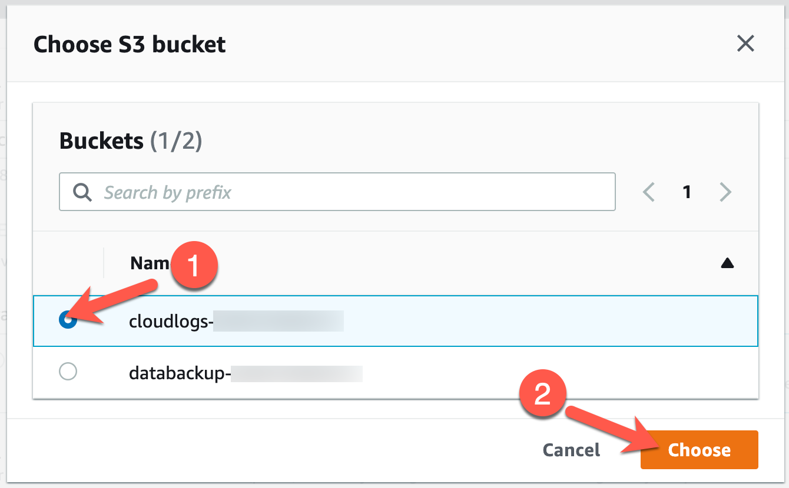

# Exercise 2: API Event Logging

<!-- markdownlint-disable MD007 MD033-->

<!--Overriding style-->
<style>
  :root {
    --sans-primary-color: #0000ff;
}
</style>

**Estimated Time to Complete:** 15 minutes

## Objectives

* Research ATT&CK Technique T1078.004 detections and discover an approach to use in your AWS account
* Create log collection S3 bucket
* Enable CloudTrail trail capturing management and data events

## Challenges

### Challenge 1: Research ATT&CK Technique T1078.004 Detections

Review [MITRE ATT&CK Technique T1078.004](https://attack.mitre.org/techniques/T1078/004/) to see how real-world adversarial groups have leveraged cloud access to further their attack campaigns. Near the bottom of the page, you will find some approaches to detect this behavior. Using the resources we have available in AWS, how could we detect a stolen credential? Could we use deception?

??? cmd "Solution"

    1. Navigate to the [MITRE ATT&CK Technique T1078.004](https://attack.mitre.org/techniques/T1078/004/) page.

    2. The first few paragraphs explain how cloud accounts can be leveraged by an attacker to access, manipulate, or even damage cloud resources.

        {: class="w400" }

    3. In the **Procedure Examples**, you will see the known threat groups that have used this technique and how it was used to their advantage.

        {: class="w600" }

    4. The **Mitigations** section shows how we, as defenders, can limit the attacker's chances of using this technique.

        {: class="w600" }

    5. Finally, the **Detection** section shows some techniques to discover this behavior in a cloud environment. 

        {: class="w600" }
    
    6. We are going to think outside the box a bit and leverage a **honey file** that was created in the last lab. Honey files simply fake bits of data that we place in key locations of our organization and, if they are accessed, we detect and immediately respond as the attacker has made their presence known. But how do we monitor and detect this?

### Challenge 2: Create Log Collection S3 Bucket

To be able to track usage of a honey file, we must monitor when it is accessed. This can be done by creating a CloudTrail Trail in AWS with S3 data events enabled. Before you can do that, though, you must create a place to store this data. The resource that will house this data is also a (separate) S3 bucket. Create an S3 bucket using CloudShell which begins with `cloudlogs-` followed by your AWS account number.

??? cmd "Solution"

    1. Return to your CloudShell session (you may need to refresh the page if it timed out).

    2. Since all S3 buckets must be unique, you can simply add your AWS account number to the end of the bucket name as it is highly unlikely that another AWS account will contain a bucket named `cloudlogs-` followed by your AWS account number. To gather this number and set it to an environment variable that will be used shortly, run the following command:

        ```bash
        ACCTNUM=$(aws sts get-caller-identity --query Account --output text)
        echo "The account number is: $ACCTNUM"
        ```

        !!! summary "Sample result"

            ```bash
            The account number is: 123456789010
            ```

    3. Now, create the S3 bucket with the name of `cloudlogs-` followed by your account number.

        ```bash
        aws s3api create-bucket --bucket cloudlogs-$ACCTNUM
        ```

        !!! summary "Sample result"

            ```bash
            {
                "Location": "/cloudlogs-123456789010"
            }
            ```

### Challenge 3: Enable CloudTrail Trail Capturing Management Events

Now that you have a bucket to store your security event data, set up a CloudTrail Trail to capture **all management events** (e.g., API calls) and **S3 data events for the S3 bucket starting with** `databackup-`. Record this data in the new S3 bucket created in challenge 2.

??? cmd "Solution"

    1. Navigate to the [CloudTrail service's trail section](https://us-east-1.console.aws.amazon.com/cloudtrail/home?region=us-east-1#/trails) in your web browser.

        !!! note

            We are using the AWS Management Console as a time-saver. This could also be done on the command line, but there is quite a bit more complexity just to properly set up the S3 bucket permissions and trail configuration—something that is automated quite nicely using the console.

    2. On the right side of the page, click on the **Create trail** button.

        {: class="w600" }

    3. Begin in the **General details** section by giving the trail the name `security` (1), selecting that you are going to use an existing bucket (2), and clicking on the **Browse** button to be shown a list of available buckets (3).

        {: class="w600" }

    4. You should now see a new window to choose your bucket where the logs will be stored. Place a check next to the bucket staring with `cloudlogs-` (1) and click **Choose** (2).

        {: class="w500" }

    5. The final item to address in the **General details** section is to create a new KMS key to encrypt this event data. Scroll down the page and enter the name `security-events` in the **AWS KMS alias** text box.

        {: class="w600" }

    6. At the bottom of the page, click **Next**.

        {: class="w200" }

    7. The next page allows you to define which type of events to record. By default, management events are selected, but you need to also capture S3 events related to your bucket containing your honey file. Place a check next to **Data events** and scroll down the page. 

        {: class="w600" }

    8. In the **Data event** section, click on the **Switch to basic event selectors** button.

        {: class="w600" }

    9. When prompted, select **Continue**.

        {: class="w400" }

    10. To select events for a particular bucket, uncheck the boxes next to **All current and future S3 buckets** (1 and 2) then click on **Browse** (3) to choose the bucket you want to monitor.

        {: class="w600" }

    11. Place a check next to the bucket with the name beginning with `databackup-` (1) and click **Choose** (2).

        {: class="w500" }

    12. Click **Next** at the bottom of the page to continue.

        {: class="w250" }

    8. On the final page, review your settings and click **Create trail** at the bottom of the page.

        {: class="w300" }

        {: class="w600" }

## Conclusion

You are now capturing all management events and certain data events in AWS and storing the artifacts in an S3 bucket! In the next exercise, you will download the honey file to generate the event data necessary to build your detection.
