# Exercise 5: Building an Automated Detection

<!-- markdownlint-disable MD007 MD033-->

<!--Overriding style-->
<style>
  :root {
    --sans-primary-color: #0000ff;
}
</style>

**Estimated Time to Complete:** 20 minutes

## Objectives

Below is the overall automated detection that we are building:

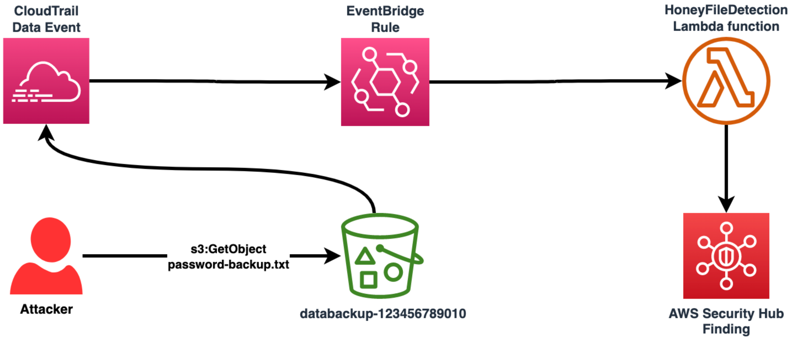{: class="w600" }

There is one component missing: the **EventBridge** rule that links this all together!

Your objectives:

* View the Lambda function that will handle the event
* Create an AWS EventBridge rule to capture a CloudTrail data events involving your `password-backup` honey file and trigger a Lambda function called `HoneyFileDetection`
* Perform T1530 (Data from Cloud Storage) once more to trigger this automation
* Review Security Hub to find your automated detection

## Challenges

### Challenge 1: View HoneyFileDetection Lambda Function

Go to the Lambda service and view the code for the `HoneyFileDetection` function. What is this function doing when it receives information from another service?

??? cmd "Solution"

    1. Navigate directly to the `HoneyFileDetection` function by going [here](https://us-east-1.console.aws.amazon.com/lambda/home?region=us-east-1#/functions/HoneyFileDetection?tab=code).

    2. If you scroll down, you can see the Python code for this function. 

        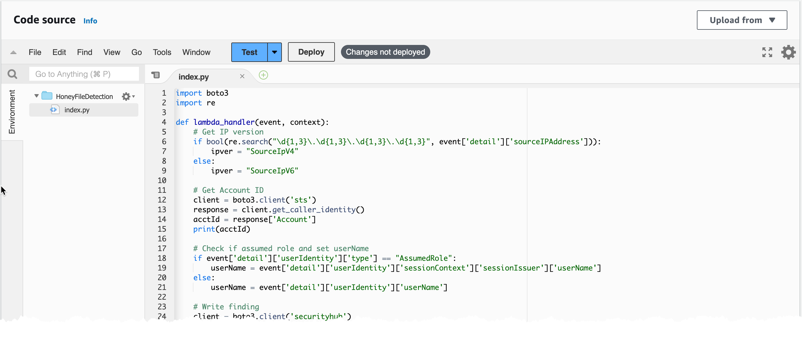{: class="w600" }
    
    3. If you have written Python before, you may be able to determine what this code is performing. If not, here is a breakdown:

        | Line numbers | Description|
        |:-------------|:-----------|
        | `1 - 2`      | Import the AWS Software Development Kit (SDK) for Python (`boto3`) and regular expression (`re`) modules necessary for this automation to function properly. |
        | `4`          | Begin handler function. This is the Python function is triggered when the Lambda function is executed. |
        | `5 - 9`      | Since the Security Hub finding that this will generate (more on this in a moment) will have a field name depending on the version of the Internet Protocol (IP) that was identified, set the proper field name by analyzing the `detail.sourceIPAddress` portion of the event that is passed into the Lambda function. |
        | `11 - 15`    | Acquire the account number for the account in which this function is running so that the generated finding contains the proper information. |
        | `17 - 21`    | As the `userName` entry can be found two different ways depending on if you are using IAM roles, this code extracts the `userName` value properly. Otherwise, the function will error (thanks Shaun McCullough :)) |
        | `23 - 62`    | Based on the information passed to the Lambda function, generate a Security Hub finding with the proper context (e.g., where the `password-backup.txt` file request came from, the name of the API call, the location of the accessed file, the type of finding, and much more). |
        | `64 - 67`    | Just a basic `return` that will inform the caller of any manual invocations that the run was successful. |

### Challenge 2: Create EventBridge Rule

Now that you understand what the function will do once called upon, create an AWS EventBridge rule with the following logic that will trigger this function in the event that anyone accesses the `password-backup.txt` honey file:

- Captures any S3 API call 
- The S3 object key acted upon has a value of `password-backup.txt` (the honey file)
- The target of the rule is the `HoneyFileDetection` Lambda function

??? cmd "Solution"

    1. Navigate to the [EventBridge service](https://us-east-1.console.aws.amazon.com/events/home?region=us-east-1#/).

    2. Begin creating a new rule by ensuring that the **EventBridge Rule** radio button is selected (1) and clicking on **Create rule** (2).

        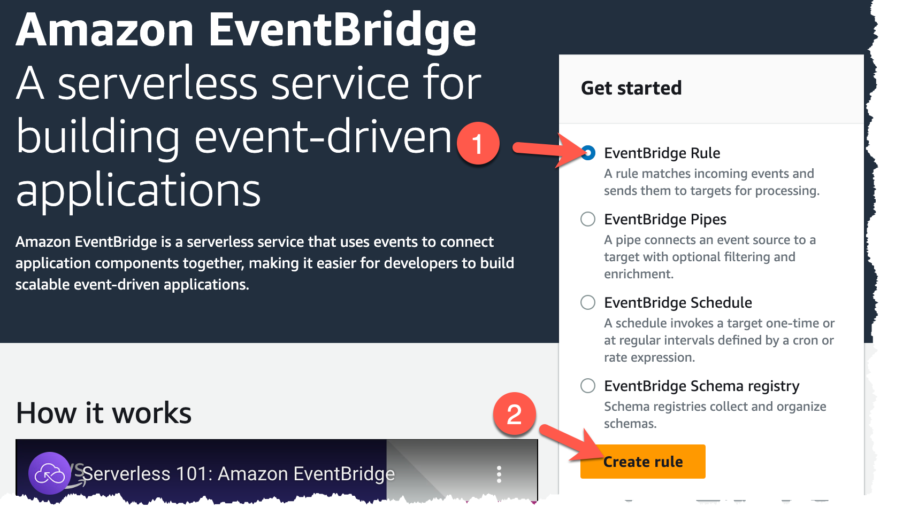{: class="w500" }

    3. When going through this rule creation wizard, the first step is to give the rule a name and determine how it will be rule (i.e., when an event occurs or on a certain schedule). Give you rule the name `honeyfile` (1), select the **Rule with an event pattern** radio button (2) (since we want to detect the honey file access as fast as we can), and click **Next** (3) to continue.

        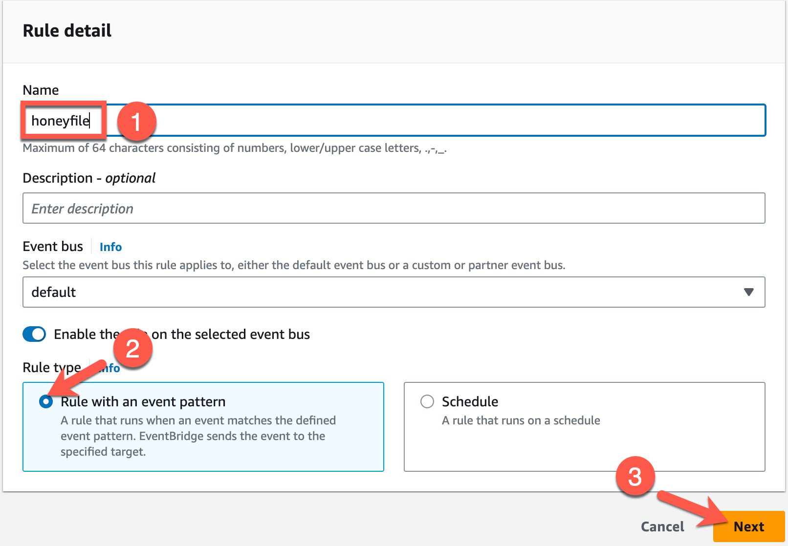{: class="w600" }

    4. The next page is where most of the heavy lifting is done. First, you must choose the event source. Since we want the EventBridge rule to fire when certain AWS API calls are made, leave the default of **AWS events or EventBridge partner events** and scroll down the page to the final part—defining the rule logic (**Event pattern**).

        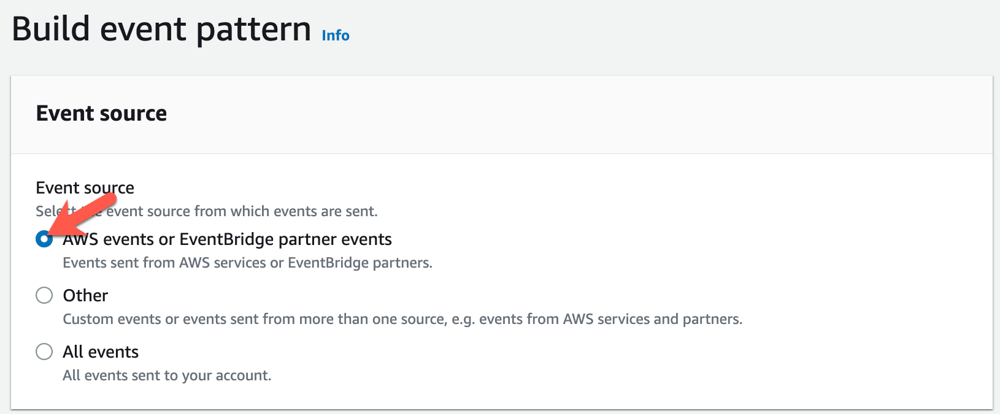{: class="w600" }

    5. In the **Event pattern** section, you can select what you are interested in detecting and AWS will build the rule logic for you... mostly. We will make a small edit to it, but first let's have AWS do most of the building for us. Since we want to detect an AWS service, leave the top dropdown as it is—set to **AWS services** (1). Next, click the **AWS service** dropdown (2) and select **Simple Storage Service (S3)** (3).

        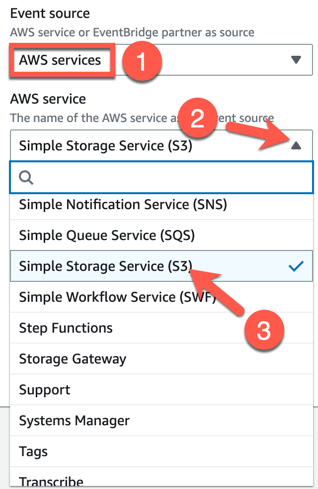{: class="w300" }

    6. After selecting S3 as your service, a new dropdown will appear. Click on the **Event type** dropdown and select **Object-Level API Call via CloudTrail** (2) since we want to know when our S3 object (the honey file) is accessed **at all**.

        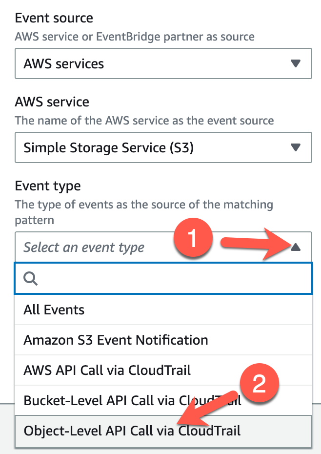{: class="w300" }

    7. After making that last selection, you should notice that the Event pattern box on the right begins to populate. This JSON document defines what EventBridge will be looking for and, if there is a match, will pass this event to a target.

        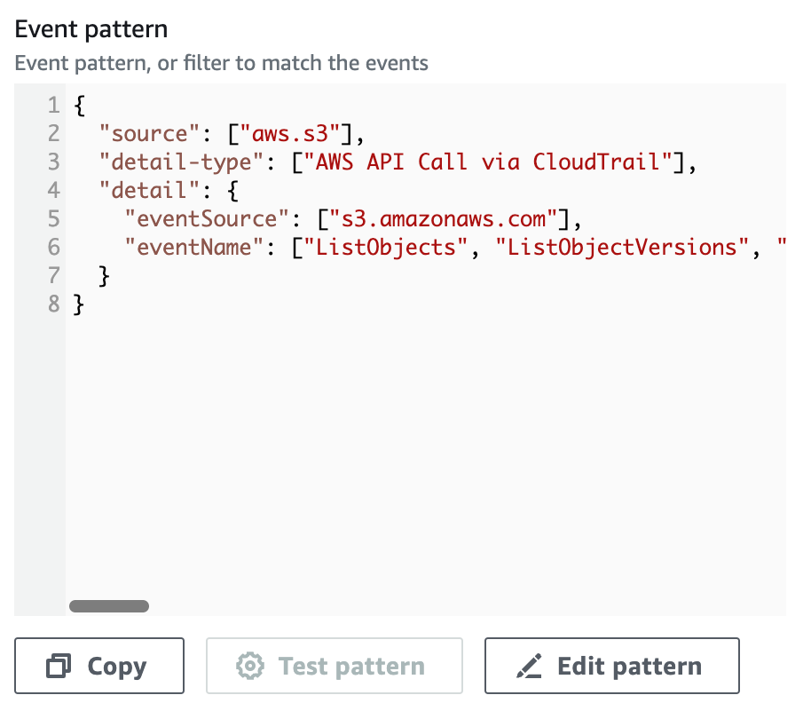{: class="w500" }

    8. So far, this is the event pattern:

        ```json
        {
            "source": ["aws.s3"],
            "detail-type": ["AWS API Call via CloudTrail"],
            "detail": {
                "eventSource": ["s3.amazonaws.com"],
                "eventName": ["ListObjects", "ListObjectVersions", "PutObject", "GetObject", "HeadObject", "CopyObject", "GetObjectAcl", "PutObjectAcl", "CreateMultipartUpload", "ListParts", "UploadPart", "CompleteMultipartUpload", "AbortMultipartUpload", "UploadPartCopy", "RestoreObject", "DeleteObject", "DeleteObjects", "GetObjectTorrent", "SelectObjectContent", "PutObjectLockRetention", "PutObjectLockLegalHold", "GetObjectLockRetention", "GetObjectLockLegalHold"]
            }
        }
        ```

    9. This would capture all events from any S3 object. This is **much too broad**. You will need to narrow this down by editing the JSON. Click on the **Edit pattern** button.

        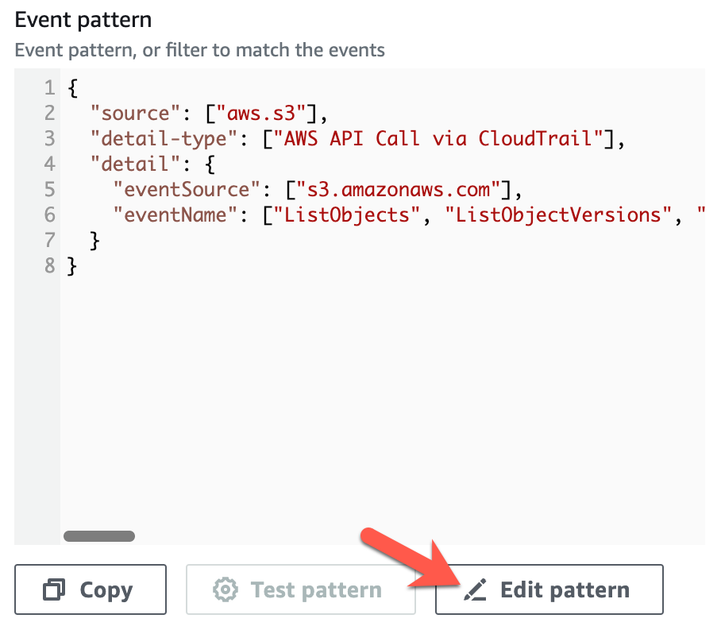{: class="w500" }

    10. You will need to specify that the requested key is equal to `password-backup.txt` so that only those interactions are passed to the target. The easiest way is to replace the JSON document with the content below (1). Click **Next** (2) when finished.

        ```json
        {
            "source": ["aws.s3"],
            "detail-type": ["AWS API Call via CloudTrail"],
            "detail": {
                "eventSource": ["s3.amazonaws.com"],
                "eventName": ["ListObjects", "ListObjectVersions", "PutObject", "GetObject", "HeadObject", "CopyObject", "GetObjectAcl", "PutObjectAcl", "CreateMultipartUpload", "ListParts", "UploadPart", "CompleteMultipartUpload", "AbortMultipartUpload", "UploadPartCopy", "RestoreObject", "DeleteObject", "DeleteObjects", "GetObjectTorrent", "SelectObjectContent", "PutObjectLockRetention", "PutObjectLockLegalHold", "GetObjectLockRetention", "GetObjectLockLegalHold"],
                "requestParameters": {
                    "key": ["password-backup.txt"]
                }
            }
        }
        ```

        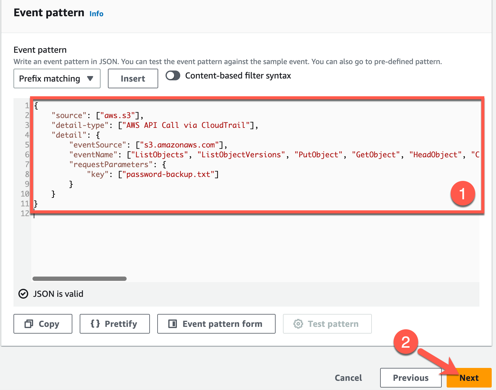{: class="w600" }

    11. The next page decides where to send this event (i.e., the **target**). Since we are sending this to another AWS service component—the `HoneyFileDetection` Lambda function, choose the **AWS service** radio button (1), click the **Select a target type** dropdown (2), and choose **Lambda function** (3).

        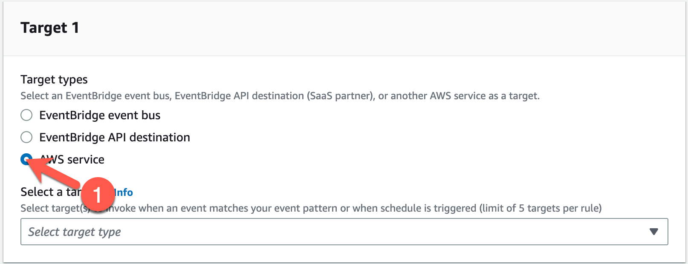{: class="w600" }

        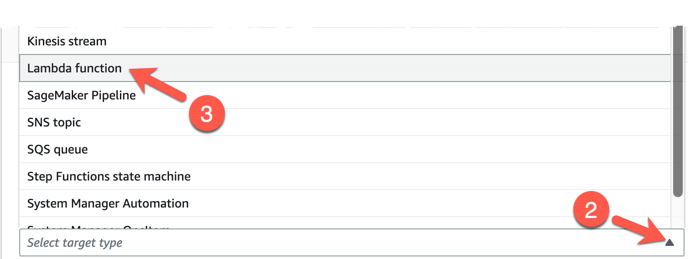{: class="w600" }

    12. A new dropdown and options will appear. Click on the **Function** dropdown (1) and choose your `HoneyFileDetection` function (2). Click **Next** (3) when finished.

        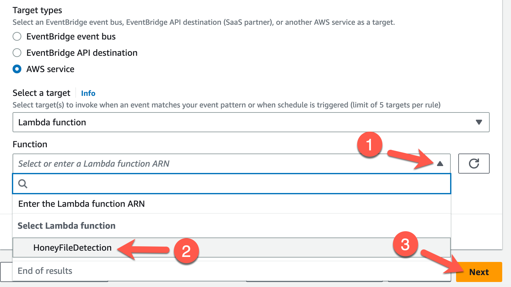{: class="w600" }

    13. And that's all we need! Click **Next on the next page (1) and **Create rule** (2) at the bottom of the final page.

        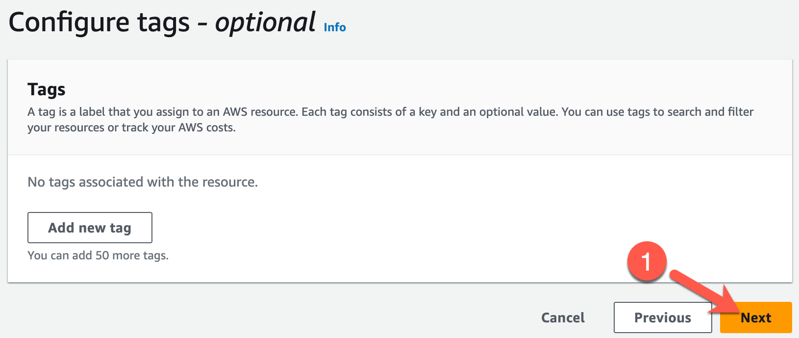{: class="w600" }

        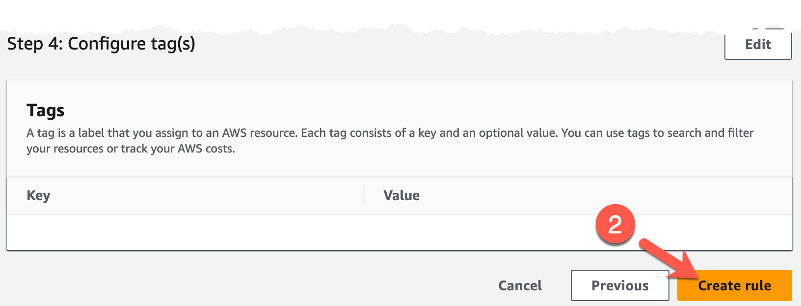{: class="w600" }

    14. The new rule should automatically be enabled.

        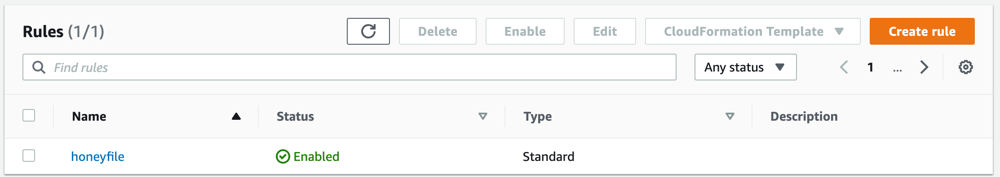{: class="w600" }

### Challenge 3: Emulate Stolen Credential Usage

Now to see if the EventBridge rule will fire, the Lambda function executes, and a new Security Hub finding will appear related to the access of the honey file. Perform the attack again by downloading the `password-backup.txt` file from S3.

??? cmd "Solution"

    1. List the bucket contents of the bucket beginning with the name `databackup-`.

        ```bash
        BUCKET=$(aws s3api list-buckets | jq -r \
          '.Buckets[] | select(.Name | startswith("databackup-")) | .Name')
        aws s3 ls s3://$BUCKET/
        ```

        !!! summary "Sample result"

            ```bash
            2023-03-19 10:16:30         91 password-backup.txt
            ```

    2. Download the `` file using the `aws s3 cp` command.

        ```bash
        aws s3 cp s3://$BUCKET/password-backup.txt /home/cloudshell-user/password-backup.txt
        ```

        !!! summary "Sample result"

            ```bash
            download: s3://databackup-123456789010/password-backup.txt to ../password-backup.txt
            ```

    3. This *should* be enough to trigger the EventBridge rule since the AWS CLI performed the `s3:GetObject` API call for you.

### Challenge 4: Review Security Hub Detection

And now for the moment of truth: to see if this automated detection generated a finding in AWS Security Hub. Navigate to the Security Hub service to discover your finding.

!!! note

    It may take a few minutes for the finding to appear, even if all went according to plan.

??? cmd "Solution"

    1. Navigate to the [Security Hub service's Summary page](https://us-east-1.console.aws.amazon.com/securityhub/home?region=us-east-1#/summary).

    2. Here, you will see a roll-up of all Security Hub compliance and finding information. To view specific findings, click on the **Findings** link in the left pane.

        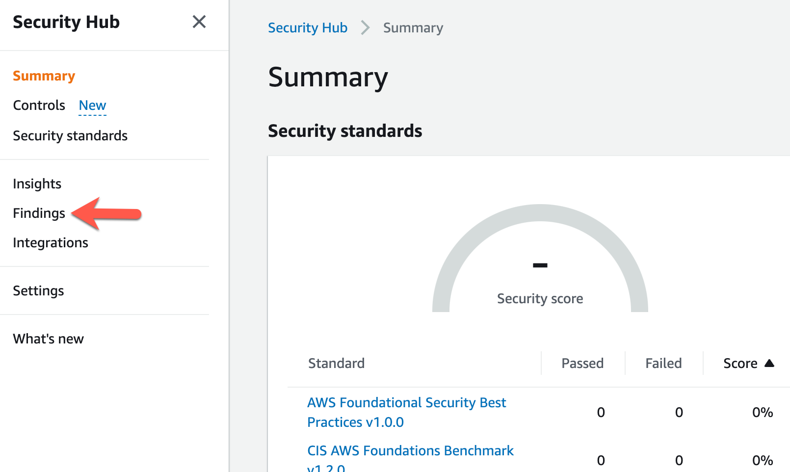{: class="w600" }

    3. When you arrive at the Findings page, you will likely see, at the top of the list of findings, one called `Honey file used`. You will even see the honey file listed in the `Resource` column. Click on that finding to reveal more details (all of which was generated by the `HoneyFileDetection` Lambda function).

        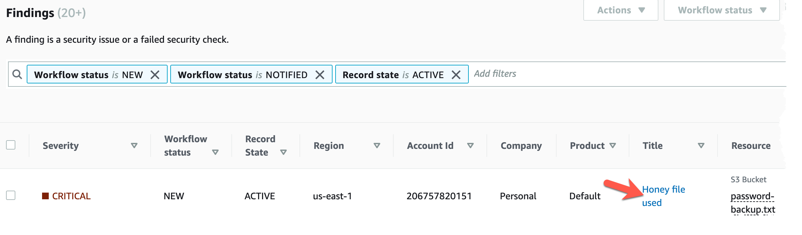{: class="w600" }

    4. You should now see a pane pop out on the right with the finding details. Feel free to expand each section to review the content populated by the Lambda function based up on the event information passed in from EventBridge.

        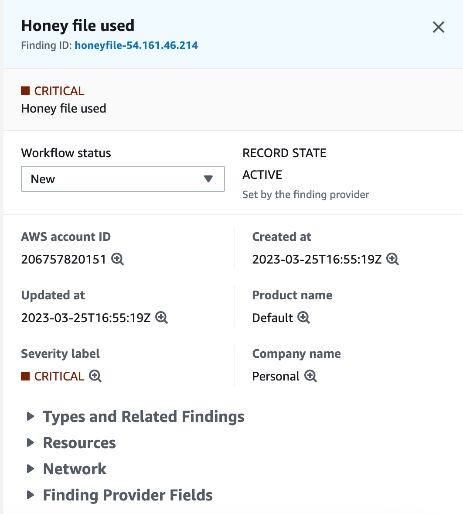{: class="w500" }

## Conclusion

Congrats! You have successfully built a detection to spot an adversary accessing a honey file! More importantly, you have walked though a process to create a detection:

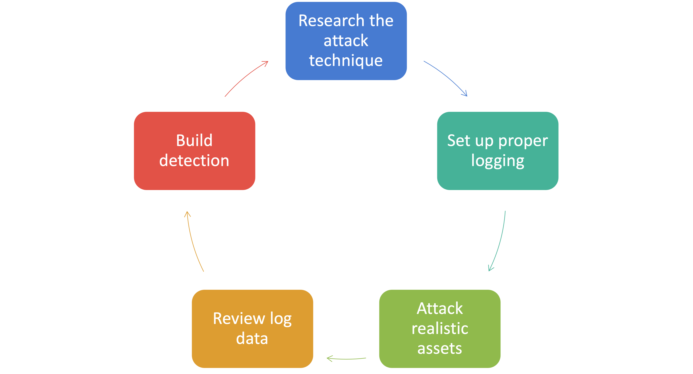{: class="w600" }