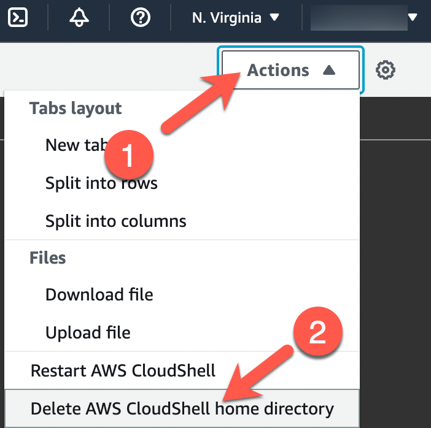
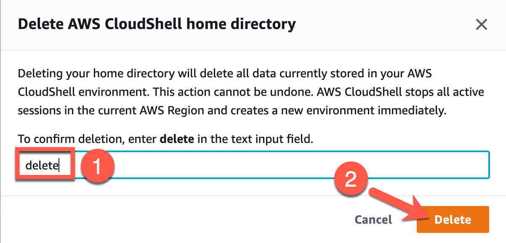

# Exercise 6: Tearing Down Serverless Application

**Estimated time to complete:** 5 minutes

## Objectives

* Teardown **evidence-app** resources using `destroy.sh`
* (Optional) Reset **CloudShell** home directory contents

## Challenges

### Challenge 1: Teardown Resources

Log back into your **CloudShell** session and use `destroy.sh` to destroy the workshop resources.

??? cmd "Solution"

    1. In your **CloudShell** session, run the following command to destroy all workbook resources:

        ```bash
        /home/cloudshell-user/building-detections-aws/scripts/destroy.sh
        ```

### Challenge 2: (Optional) Reset CloudShell Home Directory

Delete the contents of your **CloudShell** home directory.

??? cmd "Solution"

    1. In your **CloudShell session**, click on the **Actions** dropdown (1) and choose **Delete AWS CloudShell home directory** (2).

        {: class="w300" }

    2. When prompted, type `delete` in the text field (1) and click on the **Delete** button (2).

        {: class="w500" }

    3. Your **CloudShell** session should restart and your home directory will be set to default.
