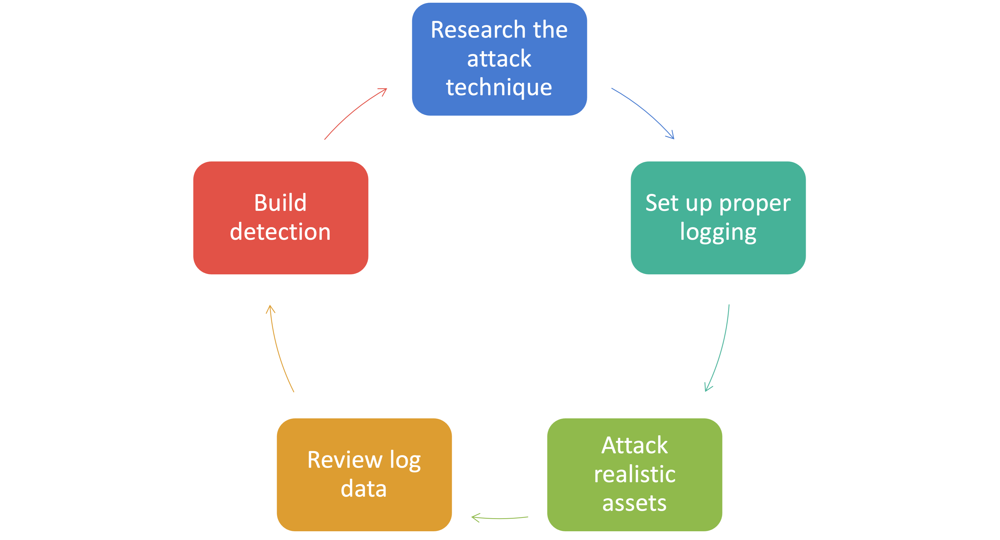

# Welcome to Building Detections in AWS

## Description

In this workshop, you will work through detection-building process previously discussed in the SANS Webcast, [Building Better Detections... By Hacking | AWS Edition](https://www.sans.org/webcasts/building-better-cloud-detections-hacking-aws-edition/). Below is the overall process we will discuss and follow:

{: class="w600" }

We will conduct the following exercises:

- [ ] [Exercise 1](exercises/exercise1.md): Deploy cloud resources with AWS CloudFormation to support both the attack and some of the automation that will be used in later exercises
- [ ] [Exercise 2](exercises/exercise2.md): Setting up appropriate logging to catch the sample attack
- [ ] [Exercise 3](exercises/exercise3.md): Conduct the sample attack
- [ ] [Exercise 4](exercises/exercise4.md): Review the log data to detect the attack
- [ ] [Exercise 5](exercises/exercise5.md): Automate the detection of the attack and test the automation
- [ ] [Exercise 6](exercises/exercise6.md): Cleanup of the workshop resources